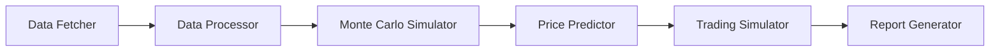

# System Architecture

## 1. Component Design

### System Components

- **Data Fetcher**: This component is responsible for fetching stock data from Yahoo Finance API.
- **Data Processor**: This component processes the fetched data and prepares it for simulations.
- **Monte Carlo Simulator**: This component performs Monte Carlo simulations on the processed data.
- **Price Predictor**: This component predicts the next day's stock price based on the simulation results.
- **Trading Simulator**: This component simulates trading based on the predicted prices and a given amount of play money.
- **Report Generator**: This component generates performance reports based on the trading results.

### Component Interactions

1. Data Fetcher fetches stock data from Yahoo Finance API.
2. Data Processor processes the fetched data.
3. Monte Carlo Simulator performs simulations on the processed data.
4. Price Predictor predicts the next day's stock price.
5. Trading Simulator simulates trading based on the predicted prices.
6. Report Generator generates performance reports.

### Data Flow

The data flows sequentially through the components, from Data Fetcher to Report Generator.

### Integration Patterns

The components are integrated in a pipeline pattern, where the output of one component is the input to the next.

## 2. Technical Decisions

### Technology Stack

- Python: Main programming language.
- Pandas: Data manipulation and analysis.
- Numpy: Numerical computations.
- Requests: HTTP requests to Yahoo Finance API.
- Matplotlib: Data visualization for performance reports.

### Database Design

No database is needed for this system as it operates on real-time data fetched from Yahoo Finance API.

### API Design

The system uses Yahoo Finance API to fetch stock data. No additional APIs are designed.

### Security Architecture

The system does not handle sensitive data, so no specific security measures are needed.

## 3. Infrastructure

### Deployment Model

The system can be deployed as a standalone application on a user's machine.

### Scaling Strategy

The system can be scaled up by increasing the computational resources (CPU and RAM) of the machine it's running on.

### Monitoring Approach

The system can be monitored by logging its operations and checking the logs for errors.

### Backup/Recovery

Since the system operates on real-time data and does not store any data, no backup/recovery measures are needed.

## Mermaid.js Diagram

