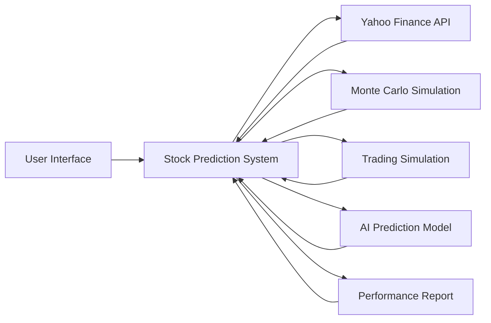

## System Architecture

## Component Descriptions

- **User Interface**: This is the front-end of the system where users can input stock symbols, run simulations, view predictions, and access performance reports.
- **Stock Prediction System**: This is the main component of the system. It fetches stock data, performs Monte Carlo simulations and trading simulations, predicts future stock prices, and generates performance reports.
- **Yahoo Finance API**: This is an external system interface used to fetch stock data.
- **Monte Carlo Simulation**: This component performs Monte Carlo simulations on the fetched stock data.
- **Trading Simulation**: This component runs trading simulations on the fetched stock data.
- **AI Prediction Model**: This component predicts future stock prices based on the fetched stock data.
- **Performance Report**: This component generates detailed performance reports based on the results of the simulations and predictions.

## Technical Decisions

- **Technology Stack**: Python for backend processing (due to its strong support for data analysis and machine learning), React for the user interface (due to its flexibility and efficiency), and Flask for the API (due to its simplicity and compatibility with Python).
- **Database Design**: A NoSQL database like MongoDB for storing stock data, simulation results, and prediction results. This is due to its flexibility and scalability.
- **API Design**: RESTful API for fetching stock data from Yahoo Finance. This is due to its simplicity and wide acceptance.
- **Security Architecture**: Use HTTPS for secure communication, OAuth for secure authentication with Yahoo Finance API, and encryption for secure storage of sensitive data.

## Infrastructure

- **Deployment Model**: Cloud-based deployment on AWS for scalability and reliability.
- **Scaling Strategy**: Use AWS's auto-scaling feature to automatically adjust resources based on demand.
- **Monitoring Approach**: Use AWS CloudWatch for monitoring system performance and logging system events.
- **Backup/Recovery**: Use AWS's backup and recovery services to regularly backup data and ensure quick recovery in case of system failure.