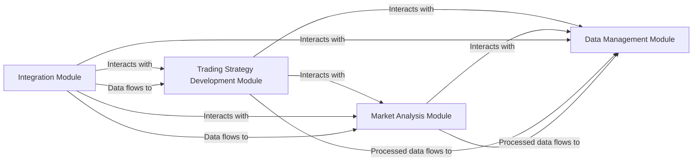

# System Architecture

## Component Design

### System Components

1. **Trading Strategy Development Module:** This module is responsible for developing and refining trading strategies. It includes features for calculating the expected value of a strategy, testing a strategy through back-testing or forward-testing, and refining a strategy based on results.

2. **Market Analysis Module:** This module is responsible for analyzing market data to identify trends and correlations. It includes features for observing market patterns and reverse engineering past market moves.

3. **Integration Module:** This module is responsible for integrating with external platforms, scanners, and documentation tools. It includes features for connecting to APIs and handling data exchange.

4. **Data Management Module:** This module is responsible for managing the data used by the application, including the strategies and market data. It includes features for storing, retrieving, updating, and deleting data.

### Component Interactions

The Trading Strategy Development Module interacts with the Market Analysis Module to use the market data and analysis results in developing and refining strategies. It also interacts with the Data Management Module to store and retrieve strategies and their results.

The Market Analysis Module interacts with the Data Management Module to store and retrieve market data and analysis results.

The Integration Module interacts with the Trading Strategy Development Module and the Market Analysis Module to provide external data and services. It also interacts with the Data Management Module to store and retrieve integration data.

### Data Flow

The data flows from the Integration Module to the Market Analysis Module and the Trading Strategy Development Module, where it is processed and used to develop and refine strategies. The processed data then flows to the Data Management Module for storage.

### Integration Patterns

The Integration Module uses the Adapter pattern to provide a consistent interface for integrating with different external platforms, scanners, and documentation tools. It also uses the Publisher-Subscriber pattern to notify the other modules when new data or services are available.

## Technical Decisions

### Technology Stack

- Backend: Python (Django or Flask)
- Frontend: React.js
- Database: PostgreSQL
- API: RESTful API
- Security: JWT for authentication, HTTPS for secure data transmission

### Database Design

The database includes tables for strategies, market data, analysis results, and integration data. Each table includes fields for the data elements required by the corresponding module.

### API Design

The API provides endpoints for managing strategies, market data, analysis results, and integration data. It supports operations for creating, reading, updating, and deleting data.

### Security Architecture

The security architecture includes measures for authentication, authorization, data encryption, and secure data transmission. It uses JWT for authentication, role-based access control for authorization, AES for data encryption, and HTTPS for secure data transmission.

## Infrastructure

### Deployment Model

The application is deployed on a cloud-based platform (e.g., AWS, Azure, or GCP) using a microservices architecture. Each module is deployed as a separate service.

### Scaling Strategy

The application uses horizontal scaling to handle increased load. New instances of the services are created as needed and load balancing is used to distribute the load.

### Monitoring Approach

The application uses a monitoring tool (e.g., Prometheus or Grafana) to track system performance and resource usage. Alerts are set up to notify the team of any issues.

### Backup/Recovery

The application uses regular backups and a disaster recovery plan to protect against data loss. The backups are stored in a separate location and the recovery plan includes steps for restoring the system and data.

# Mermaid.js Diagram

This diagram shows the interactions and data flow between the system components. The arrows represent the direction of the interactions and data flow.