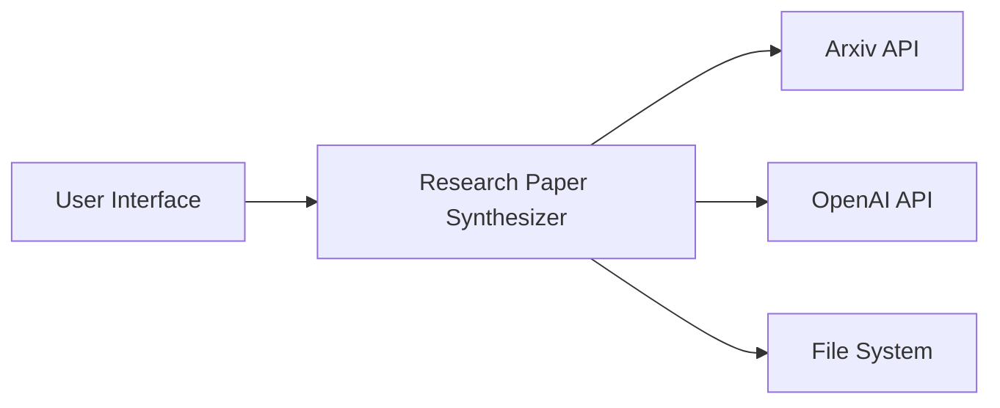

# System Architecture

## Component Design

### System Components

The system is composed of the following components:

1. **User Interface (UI)**: This is the entry point of the system where users input their search term.

2. **Research Paper Synthesizer (RPS)**: This is the core component of the system. It retrieves research papers, analyzes and combines them, generates a new paper, and formats and saves the results.

3. **Arxiv API**: This is an external service that the RPS uses to retrieve research papers.

4. **OpenAI API**: This is another external service that the RPS uses to analyze and combine papers and generate a new paper.

5. **File System**: This is where the RPS saves the formatted paper in a JSON file.

### Component Interactions

The interactions between the components are as follows:

1. The user inputs a search term in the UI.
2. The UI sends the search term to the RPS.
3. The RPS sends a query with the search term to the Arxiv API.
4. The Arxiv API returns a list of research papers to the RPS.
5. The RPS sends each paper to the OpenAI API for analysis.
6. The OpenAI API returns the analysis results to the RPS.
7. The RPS combines the analysis results and sends them to the OpenAI API to generate a new paper.
8. The OpenAI API returns the generated paper to the RPS.
9. The RPS formats the generated paper and saves it in the File System.

### Data Flow

The data flows in the system as follows:

1. The search term flows from the UI to the RPS.
2. The search term flows from the RPS to the Arxiv API.
3. The list of research papers flows from the Arxiv API to the RPS.
4. Each paper flows from the RPS to the OpenAI API.
5. The analysis results flow from the OpenAI API to the RPS.
6. The combined analysis results flow from the RPS to the OpenAI API.
7. The generated paper flows from the OpenAI API to the RPS.
8. The formatted paper flows from the RPS to the File System.

### Integration Patterns

The system uses the following integration patterns:

1. **Request-Reply**: The RPS sends a request to the Arxiv API and waits for a reply. The same pattern is used between the RPS and the OpenAI API.

2. **File Transfer**: The RPS writes the formatted paper to a file in the File System.

## Technical Decisions

### Technology Stack

The system could be implemented using the following technology stack:

- **Python**: This is a versatile and powerful programming language that is widely used in data analysis and machine learning. It has libraries for interacting with the Arxiv and OpenAI APIs.

- **Flask**: This is a lightweight web framework for Python. It could be used to implement the UI.

- **Docker**: This is a platform for developing, shipping, and running applications in containers. It could be used to package the system for deployment.

### Database Design

The system does not require a database because it does not need to store any data permanently. The research papers are retrieved from the Arxiv API on demand, and the generated paper is saved in a file in the File System.

### API Design

The system interacts with two APIs:

1. **Arxiv API**: The RPS sends a GET request to the `/query` endpoint with the search term as a query parameter.

2. **OpenAI API**: The RPS sends POST requests to the `/analysis` and `/generation` endpoints with the paper or combined analysis results in the request body.

### Security Architecture

The system needs to secure the communication with the Arxiv and OpenAI APIs. This could be achieved by using HTTPS and API keys. The API keys should be stored securely and not included in the source code.

## Infrastructure

### Deployment Model

The system could be deployed as a Docker container in a cloud computing platform like AWS, Google Cloud, or Azure.

### Scaling Strategy

The system could be scaled horizontally by running multiple instances of the Docker container behind a load balancer.

### Monitoring Approach

The system could be monitored using a service like AWS CloudWatch or Google Stackdriver. These services can collect and analyze logs and metrics from the system and send alerts when there are issues.

### Backup/Recovery

The system does not need a backup/recovery strategy because it does not store any data permanently. The generated papers are saved in files in the File System, and they could be backed up using a file backup service if necessary.

# Mermaid.js Diagram

This diagram shows the components of the system and their interactions. The arrows represent the flow of data in the system.