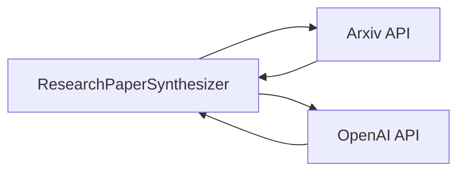

# System Architecture

## 1. Component Design

### System Components

The system is composed of the following main components:

1. **ResearchPaperSynthesizer**: This is the main class that encapsulates all the functionalities of the system. It interacts with external APIs to retrieve and analyze research papers, and generates a new research paper based on the analysis.

2. **Arxiv API**: This is an external API that the system uses to retrieve the full text of the research papers.

3. **OpenAI API**: This is another external API that the system uses to analyze the research papers and identify common themes.

### Component Interactions

The `ResearchPaperSynthesizer` class interacts with the `Arxiv API` to retrieve the full text of the research papers, and with the `OpenAI API` to analyze the papers and identify common themes.

### Data Flow

The data flows in the following sequence:

1. The `ResearchPaperSynthesizer` sends a request to the `Arxiv API` to retrieve the full text of the research papers.

2. The `Arxiv API` returns the full text of the papers, which the `ResearchPaperSynthesizer` stores in the `paper_texts` list.

3. The `ResearchPaperSynthesizer` sends a request to the `OpenAI API` to analyze the `paper_texts` list and identify common themes.

4. The `OpenAI API` returns the common themes, which the `ResearchPaperSynthesizer` stores in the `common_themes` list.

5. The `ResearchPaperSynthesizer` uses the `common_themes` list to generate a new research paper, which it stores in the `generated_paper` variable.

6. The `ResearchPaperSynthesizer` formats the `generated_paper` in Markdown and returns it.

### Integration Patterns

The system uses the `Request-Response` integration pattern to interact with the `Arxiv API` and the `OpenAI API`. The `ResearchPaperSynthesizer` sends a request to the APIs and waits for a response.

## 2. Technical Decisions

### Technology Stack

The system is implemented in Python, which is a versatile language that is widely used in data analysis and machine learning tasks. The system also uses the `requests` library to interact with the APIs, and the `markdown` library to format the generated paper in Markdown.

### Database Design

The system does not use a database, as it does not need to persist data. All data is stored in memory and discarded when the system finishes running.

### API Design

The system uses the `Arxiv API` to retrieve the full text of the research papers, and the `OpenAI API` to analyze the papers and identify common themes. The APIs are accessed using the `requests` library in Python.

### Security Architecture

The system uses API keys to authenticate with the `Arxiv API` and the `OpenAI API`. The keys are securely stored and handled.

## 3. Infrastructure

### Deployment Model

The system is a standalone Python script that can be run on any machine that has Python installed. It does not need to be deployed on a server.

### Scaling Strategy

The system is not designed to scale, as it is a standalone script. However, if needed, the script could be modified to run in parallel on multiple machines, each processing a different set of papers.

### Monitoring Approach

The system does not have a built-in monitoring mechanism, as it is a standalone script. However, the script could be modified to log its progress and any errors that occur.

### Backup/Recovery

The system does not have a backup/recovery mechanism, as it does not persist data. All data is stored in memory and discarded when the system finishes running.

# Mermaid.js Diagram

In this diagram, the `ResearchPaperSynthesizer` interacts with the `Arxiv API` and the `OpenAI API`. The arrows represent the data flow between the components.