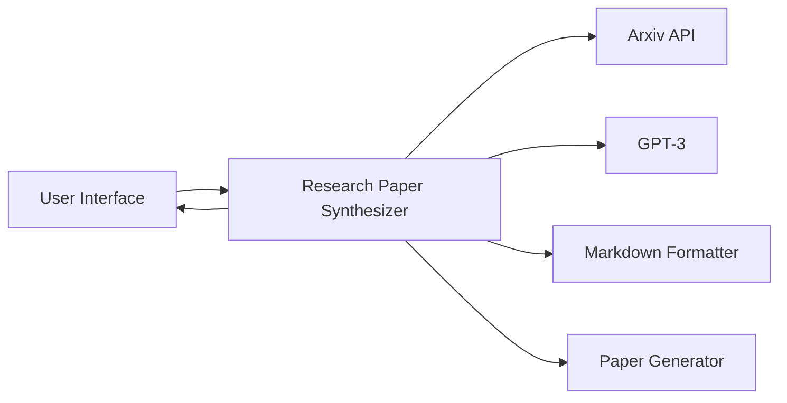

# System Architecture

## 1. Component Design

### System Components

The system is composed of the following main components:

1. User Interface: This is the component through which users interact with the system. It collects paper IDs from the user and displays the synthesized research paper.

2. Research Paper Synthesizer: This is the core component of the system. It retrieves papers from the Arxiv API, analyzes and combines them using GPT-3, formats the combined paper in Markdown, and generates a new research paper.

3. Arxiv API: This component provides access to research papers based on their IDs.

4. GPT-3: This component analyzes and combines the retrieved papers.

5. Markdown Formatter: This component formats the combined paper in Markdown.

6. Paper Generator: This component generates a new research paper based on the formatted paper.

### Component Interactions

The User Interface interacts with the Research Paper Synthesizer, which in turn interacts with the Arxiv API, GPT-3, Markdown Formatter, and Paper Generator.

### Data Flow

The data flows from the User Interface to the Research Paper Synthesizer, which retrieves papers from the Arxiv API, analyzes and combines them using GPT-3, formats the combined paper in Markdown, and generates a new research paper. The synthesized paper is then returned to the User Interface for display.

### Integration Patterns

The system uses the Service-Oriented Architecture (SOA) integration pattern. The Arxiv API and GPT-3 are external services that the Research Paper Synthesizer interacts with.

## 2. Technical Decisions

### Technology Stack

The system can be implemented using the following technology stack:

- Frontend: React.js for the User Interface.
- Backend: Python for the Research Paper Synthesizer, with Flask or Django as the web framework.
- External Services: Arxiv API for retrieving papers and OpenAI GPT-3 for analyzing and combining papers.

### Database Design

Since the system does not need to store any data, a database is not required.

### API Design

The system interacts with the Arxiv API to retrieve papers and with OpenAI GPT-3 to analyze and combine papers.

### Security Architecture

The system needs to ensure secure communication with the Arxiv API and OpenAI GPT-3. This can be achieved by using HTTPS for all API calls and by securely storing and handling API keys.

## 3. Infrastructure

### Deployment Model

The system can be deployed on a cloud platform like AWS or Google Cloud.

### Scaling Strategy

The system can be scaled horizontally by adding more instances as the load increases. Load balancing can be used to distribute the load among the instances.

### Monitoring Approach

The system can be monitored using tools like AWS CloudWatch or Google Stackdriver.

### Backup/Recovery

Since the system does not store any data, backup and recovery are not required.

# Mermaid.js Diagram

In this diagram, the arrows represent the direction of data flow. The User Interface sends paper IDs to the Research Paper Synthesizer, which retrieves papers from the Arxiv API, analyzes and combines them using GPT-3, formats the combined paper in Markdown, generates a new research paper, and sends it back to the User Interface.