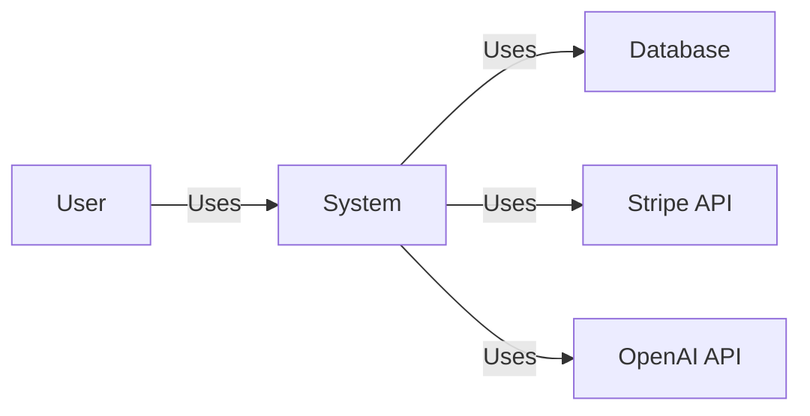
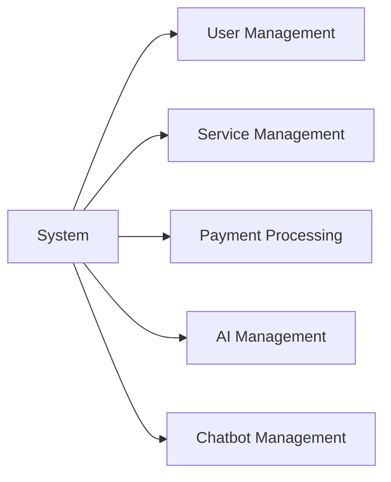
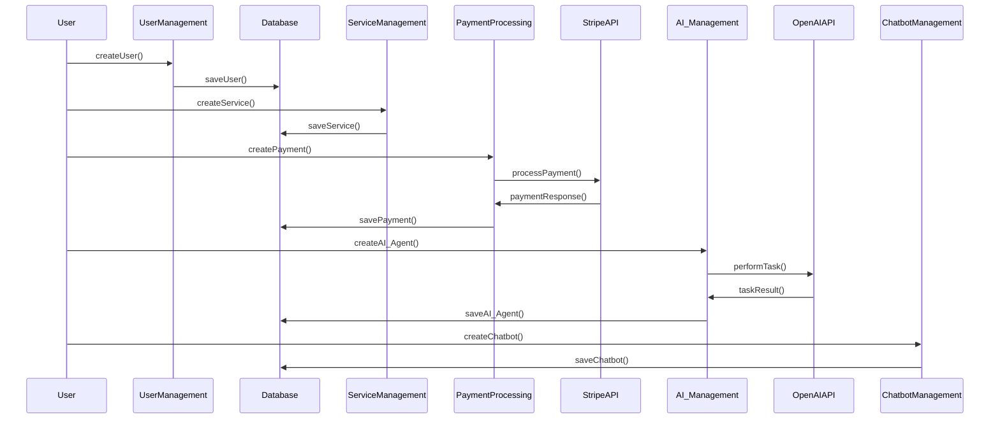
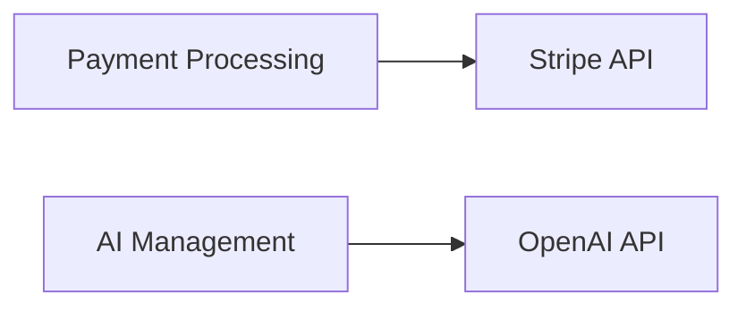
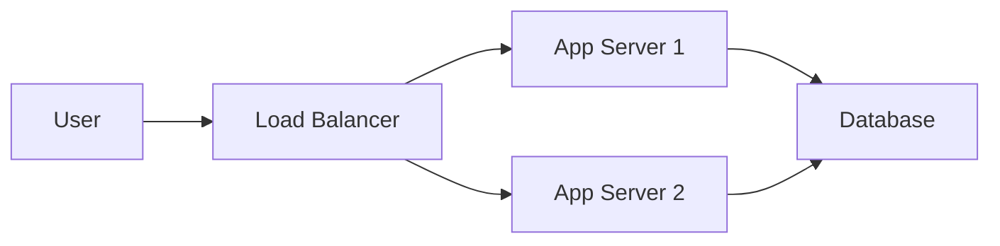

## 1. System Architecture Overview
### 1.1 Architecture Style
- **Microservices Architecture**: This architecture style is selected for its ability to provide scalability, maintainability, and reliability. Each component of the system can be developed, deployed, and scaled independently, which is crucial for a system that needs to handle high loads and provide high availability.

### 1.2 System Context

## 2. Component Design
### 2.1 Core Components

### 2.2 Data Flow

## 3. Technology Stack
### 3.1 Selected Technologies
- **Infrastructure**: AWS for its wide range of services and scalability.
- **Framework**: Node.js for backend due to its non-blocking, event-driven architecture.
- **Database**: MongoDB for its flexibility and scalability.
- **Third-party services**: Stripe for payment processing, OpenAI for AI tasks.

### 3.2 Integration Architecture

## 4. Deployment Architecture
### 4.1 Deployment Model

### 4.2 Infrastructure Requirements
- **Scaling strategy**: Horizontal scaling by adding more application servers as the load increases.
- **High availability approach**: Load balancing across multiple application servers, and data replication in the database.
- **Disaster recovery plan**: Regular backups of the database, and use of AWS's disaster recovery services.