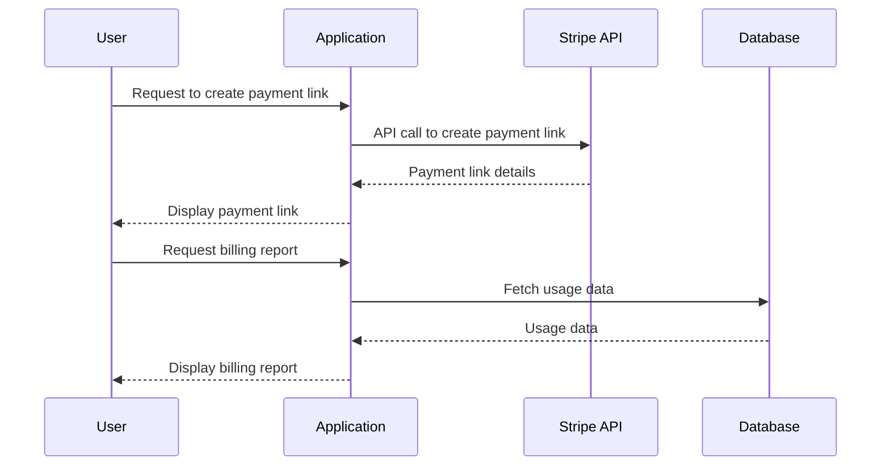
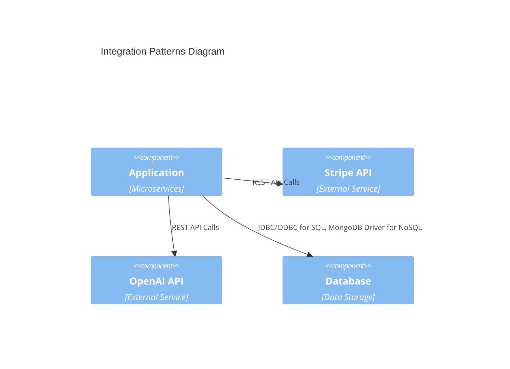

To create a comprehensive system architecture based on your provided requirements, let's break down each section systematically, focusing on scalability, maintainability, and reliability.

## 1. System Architecture Overview

### 1.1 Architecture Style
- **Selected Architecture Pattern(s):** 
  - **Microservices Architecture:** This pattern allows for independent deployment and scaling of services, which is essential for handling different components like payment processing and virtual card management.
  - **Justification for Choices:**
    - **Scalability:** Each service can be scaled independently based on its load.
    - **Maintainability:** Services are decoupled, making it easier to update or refactor individual components without affecting others.
    - **Reliability:** Failures in one service can be isolated, reducing the impact on the overall system.
  - **Key Quality Attributes Addressed:**
    - Scalability: Through independent scaling of microservices.
    - Maintainability: Via decoupled service design.
    - Reliability: Through service isolation and fault tolerance.

### 1.2 System Context
```mermaid
C4Context
  title System Context Diagram
  Boundary(User)[User] {
    Component(App)[Application]
  }
  Boundary(ExternalSystems)[External Systems] {
    Component(StripeAPI)[Stripe API]
    Component(OpenAIAPI)[OpenAI API]
  }
  Rel(User, App, "Interacts with")
  Rel(App, StripeAPI, "Uses for payment processing")
  Rel(App, OpenAIAPI, "Uses for data analysis")
```

## 2. Component Design

### 2.1 Core Components
```mermaid
C4Component
  title Core Components Diagram
  Container(App, "Application", "Microservices") {
    Component(PaymentLinkManager, "PaymentLinkManager", "Service")
    Component(BillingManager, "BillingManager", "Service")
    Component(VirtualCardManager, "VirtualCardManager", "Service")
  }
  Rel(PaymentLinkManager, StripeAPI, "Creates and manages payment links")
  Rel(BillingManager, Database, "Stores and retrieves usage data")
  Rel(VirtualCardManager, PaymentProcessorAPI, "Manages virtual cards")
```

### 2.2 Data Flow


## 3. Technology Stack

### 3.1 Selected Technologies
- **Infrastructure Choices:** 
  - **Cloud Provider:** AWS or Google Cloud for scalability and reliability.
  - **Containerization:** Docker for consistent deployment environments.
  - **Orchestration:** Kubernetes for managing microservices.
- **Framework Selection:** 
  - **Backend:** Node.js with Express.js for the REST API.
  - **Frontend:** React.js for a responsive user interface.
- **Database Decisions:** 
  - **Relational Database:** PostgreSQL for structured data.
  - **NoSQL Database:** MongoDB for flexible data storage when needed.
- **Third-party Services:** 
  - **Payment Processing:** Stripe API.
  - **Data Analysis:** OpenAI API for advanced data processing.

### 3.2 Integration Architecture


## 4. Deployment Architecture

### 4.1 Deployment Model
```mermaid
deploymentDiagram
  node "Cloud Provider" {
    node "Kubernetes Cluster" {
      component "PaymentLinkManager"
      component "BillingManager"
      component "VirtualCardManager"
    }
    database "PostgreSQL" {
      component "UsageDataStore"
    }
    database "MongoDB" {
      component "FlexibleDataStore"
    }
  }
```

### 4.2 Infrastructure Requirements
- **Scaling Strategy:** 
  - Use Kubernetes Horizontal Pod Autoscaling to adjust the number of pod instances based on CPU and memory usage.
- **High Availability Approach:** 
  - Deploy services across multiple availability zones and use load balancers to distribute traffic.
- **Disaster Recovery Plan:** 
  - Implement automated database backups and use a multi-region replication strategy to ensure data availability and integrity during failures.

This architecture is designed to be comprehensive, addressing critical aspects of scalability, maintainability, and reliability by leveraging modern cloud-native technologies and design patterns.