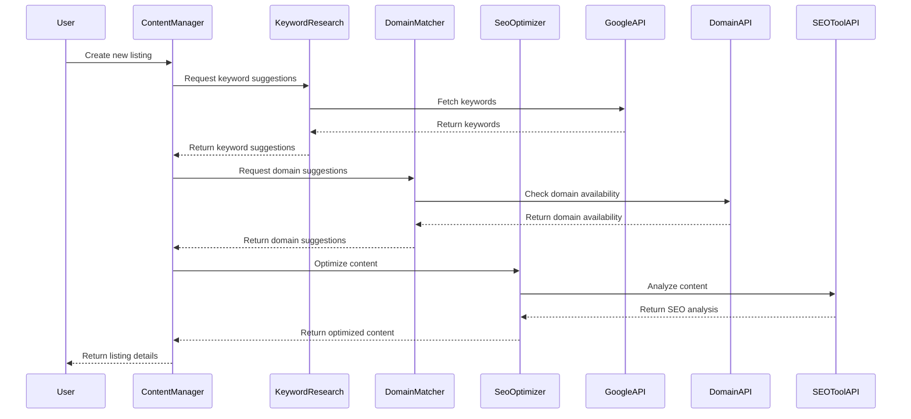
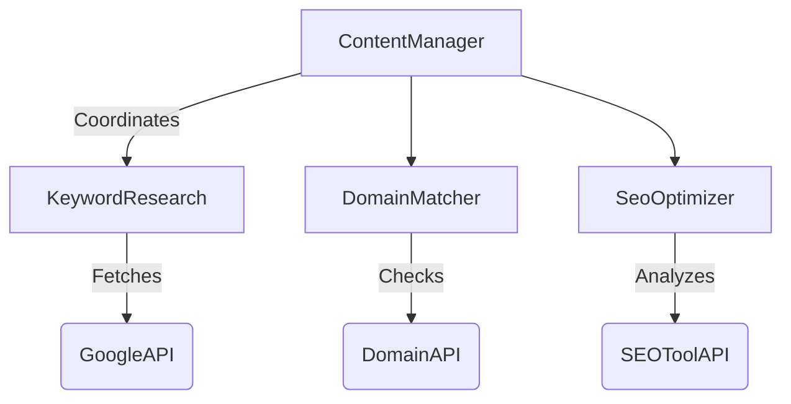

To design a comprehensive system architecture for the online directory platform, we need to focus on scalability, maintainability, and reliability. Here's a detailed breakdown of the system architecture:

## 1. System Architecture Overview

### 1.1 Architecture Style

- **Selected Architecture Pattern(s):** 
  - **Microservices Architecture:** This pattern is chosen for its scalability and maintainability. Each core module (KeywordResearch, DomainMatcher, SeoOptimizer, ContentManager) is implemented as an independent microservice.
  - **Event-Driven Architecture:** Used for asynchronous communication between services, enhancing reliability and responsiveness.

- **Justification for Choices:**
  - **Scalability:** Microservices can be independently scaled based on demand.
  - **Maintainability:** Each service can be developed, deployed, and maintained independently.
  - **Reliability:** Event-driven architecture allows for resilient communication between services.

- **Key Quality Attributes Addressed:**
  - **Scalability:** Horizontal scaling of services.
  - **Maintainability:** Modular codebase with clear service boundaries.
  - **Reliability:** Fault-tolerant communication and error handling.

### 1.2 System Context

```mermaid
C4Context
title System Context Diagram for Online Directory Platform
Boundary(Platform) {
    System(DirectoryPlatform, "Online Directory Platform", "Provides keyword, domain, and SEO services")
    System_Ext(User, "User", "Interacts with the platform")
    System_Ext(GoogleAPI, "Google Keyword Planner API", "Provides keyword data")
    System_Ext(DomainAPI, "Domain Registration API", "Checks domain availability")
    System_Ext(SEOToolAPI, "SEO Tool API", "Analyzes SEO content")
    
    User -> DirectoryPlatform : Uses
    DirectoryPlatform -> GoogleAPI : Fetches keyword data
    DirectoryPlatform -> DomainAPI : Checks domain availability
    DirectoryPlatform -> SEOToolAPI : Analyzes SEO content
}
```

## 2. Component Design

### 2.1 Core Components

```mermaid
C4Component
title Component Diagram for Online Directory Platform
Container_Boundary(DirectoryPlatform, "Online Directory Platform") {
    Component(KeywordResearch, "KeywordResearch", "Microservice", "Generates keyword suggestions")
    Component(DomainMatcher, "DomainMatcher", "Microservice", "Suggests available domain names")
    Component(SeoOptimizer, "SeoOptimizer", "Microservice", "Optimizes SEO content")
    Component(ContentManager, "ContentManager", "Microservice", "Manages directory listings")
    
    KeywordResearch -> GoogleAPI : Fetches keyword data
    DomainMatcher -> DomainAPI : Checks domain availability
    SeoOptimizer -> SEOToolAPI : Analyzes SEO content
}
```

### 2.2 Data Flow



## 3. Technology Stack

### 3.1 Selected Technologies

- **Infrastructure Choices:**
  - **Cloud Provider:** AWS or GCP for scalable infrastructure.
  - **Containerization:** Docker for packaging microservices.

- **Framework Selection:**
  - **Backend:** Spring Boot (Java) or Express.js (Node.js) for microservices.
  - **Frontend:** React.js for user interface.

- **Database Decisions:**
  - **Primary Database:** PostgreSQL for relational data.
  - **Cache:** Redis for caching frequently accessed data.

- **Third-Party Services:**
  - **Google Keyword Planner API**
  - **Domain Registration API**
  - **SEO Tool API**

### 3.2 Integration Architecture



## 4. Deployment Architecture

### 4.1 Deployment Model

```mermaid
C4Deployment
title Deployment Diagram for Online Directory Platform
Node(Cloud, "Cloud Provider") {
    Node(Cluster, "Kubernetes Cluster") {
        Container(KeywordResearchPod, "KeywordResearch", "Docker Container")
        Container(DomainMatcherPod, "DomainMatcher", "Docker Container")
        Container(SeoOptimizerPod, "SeoOptimizer", "Docker Container")
        Container(ContentManagerPod, "ContentManager", "Docker Container")
    }
    Node(Database, "PostgreSQL")
    Node(Cache, "Redis")
}
```

### 4.2 Infrastructure Requirements

- **Scaling Strategy:**
  - **Horizontal Scaling:** Use Kubernetes to scale pods based on load.
  - **Auto-scaling:** Configure auto-scaling policies for each microservice.

- **High Availability Approach:**
  - **Load Balancing:** Use a cloud load balancer to distribute traffic.
  - **Redundancy:** Deploy multiple instances of each service.

- **Disaster Recovery Plan:**
  - **Data Backups:** Regular backups of PostgreSQL and Redis.
  - **Failover Strategy:** Use multi-region deployments for critical services.

This architecture ensures that the online directory platform is scalable, maintainable, and reliable, meeting the specified requirements effectively.